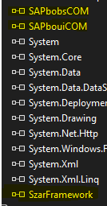

# SzarFramework
Biblioteca para auxiliar no desenvolvimento de addons para sap B1.
Para iniciar um projeto UI utilizando a biblioteca tem que fazer referencia as bibliotecas.

- SzarFramework
- SAPbobsCOM
- SAPbouiCOM




## Exemplos de conexão
```C#
//INICIANDO CONEXÃO UI-DI
ConnectUI con = new ConnectUI();
con.Connect("Namespace Projeto".GetTypesFromAssembly(), true);

//INICIANDO CONEXÃO DI
ConnectDI con = new ConnectDI();
con.Server = "SERVER";
con.LicenseServer = "SERVER:30000";
con.CompanyDB = "SboDbCompany";
con.UserName = "usuario";
con.Password = "senha";
con.DbUserName = "usuario banco dados";
con.DbPassword = "senha banco dados";
con.DbServerType = BoDataServerTypes.dst_MSSQL2014; //tipo de banco
con.Language = BoSuppLangs.ln_Portuguese_Br; //linguagem da conexão
bool conected = con.Connect();
```

#### Depois de efetuada a conexão UI fica disponível dois objetos principais para uso e é adicionada algumas extensões para facilitar o desenvolvimento de aplicativos para B1. Abaixo alguns detalhamentos:

- `B1AppDomain` -> disponibiliza principalmente o "company" e o "Application" de uma conexão normal no SAP.
- `B1Exception` -> disponibiliza forma pratica para descrever as exceptions que ocorreram no desenvolvimento do seu Add-on.

# Extensões liberadas

## `SAPbouiCOM.Application`
- `OpenForm` : Foi adicionado um overload para disponibilizar a abertura de formularios `XML` de forma simples passando duas strings e retornando um objeto `SAPbouiCOM.Form`, ex:
```C#
B1AppDomain.Application.OpenForm("XML da tela", "ID da tela");
```    

## `SAPbouiCOM.ComboBox`
- `ClearData` : Foi criado para limpar de forma rapida um `ComboBox` retornando um boolean como resposta.
```C#

```

## `SAPbouiCOM.Form`
- `FolderDialog` : Opção para abrir a janela de seleção de pastas, podendo passar como parametro uma mensagem para que apareça na janela de seleção ou passar a mensagem e o campo na tela que tem que ser preechido com o caminho da pasta.
```C#

```
- `FileDialog` : Opção para abrir a janela de seleção de aquivos, podendo passar como paramento uma mensagem e o nome do campo na tela que tem que ser preenchido ou passar somente a mensagem e ele tem duas saidas uma com o nome do arquivo e outro com o caminho.
```C#

```

## `SAPbouiCOM.Menus`
- `Add` : Foi adicionado um overload no metodo para adicionar diretamente o menu.
```C#

```
- `AddContext` : Opção para adicionar menu de contexto.
```C#

```
- `RemoveContext` : Opção para remover menu de contexto.
```C#

```

## `SAPbobsCOM.Recordset`
- `DoQuery` : Foi adicionado um overload para que passando a query de consulta e um objeto ele retorne este objeto preenchido com os dados da consulta desde que os nomes dos campos sejam os mesmos.
```C#

```

# Gerenciamento de Eventos
 - Direcionando eventos de telas de usuarios
 - Direcionando eventos de telas de sistema
 - Direcionando eventos de Menu
 - Direcionando eventos de MenuContext
# Gerenciamento de Tabelas de usuários
 - Criando uma tabela (noObject)
 - Criando uma tabela (MasterData)
 - Criando uma tabela (Document)
# Gerenciamento de campos de usuários
 - Criando campos em tabelas de usuários
 - Criando campos em tabelas de sistema
 - Alterando campos em tabelas de usuários e sistema
# Gerenciamento de objetos UDO
 - Registrando um objeto (MasterData)
 - Registrando um objeto (MasterData) com filhos
 - Registrando um objeto (Document)
 - Registrando um objeto (Document) com filhos

# Criando projeto Hello World
   